## 前言

我对 ACM 一直怀着两种近乎矛盾的态度。一方面，若能拿到区域赛银牌及以上的奖项，它确实会成为履历上相当漂亮的一笔；可另一方面，为了加训所付出的时间与精力，也注定会挤占掉大学生活中许多其他可能性。更何况，ACM 归根到底仍是一项带有“做题家”气质的竞赛，它无法替代真正的工程能力、科研积累。于我而言，“锦上添花”或许是对它最恰当的形容。

但无论如何，它终究是一段难忘的经历。它极大地丰富了我的大学生活，也让我遇见了许多志同道合的人。接下来，就简单讲讲我与 ACM 的这段缘分。

## 大一学期——加入ACM校队

第一次接触 ACM，是在大一参加“可达鸭杯”的时候。当时比赛通知刚发出来，还允许线上参赛，我便下意识以为这不过是一场“水赛”，没有任何准备，赛时连输入输出都得现场百度。写五子棋那道题时，我被各种边界情况卡得死去活来，最后遗憾无缘决赛。那大概是我第一次意识到：看似简单的题目，真写起来也未必那么简单。

到了大一下，我又看到了新星赛的通知。有了“可达鸭杯”的前车之鉴，这一次我提前准备了一些输入输出模板，算是稍微认真了些。可彼时我的主要精力仍放在数学建模上，编程语言也只会 Python。面对这种显然更利好 C++ 这种编程语言的程序设计竞赛，我多少有些硬着头皮上场的意味。所幸结果还不错，单纯凭借一些数学直觉和思维能力，我拿到了银奖，也顺利进入了 ACM 校队。也正是在校队里，我认识了另外两位来自数院的选手 ，后来他们便成了我的队友。

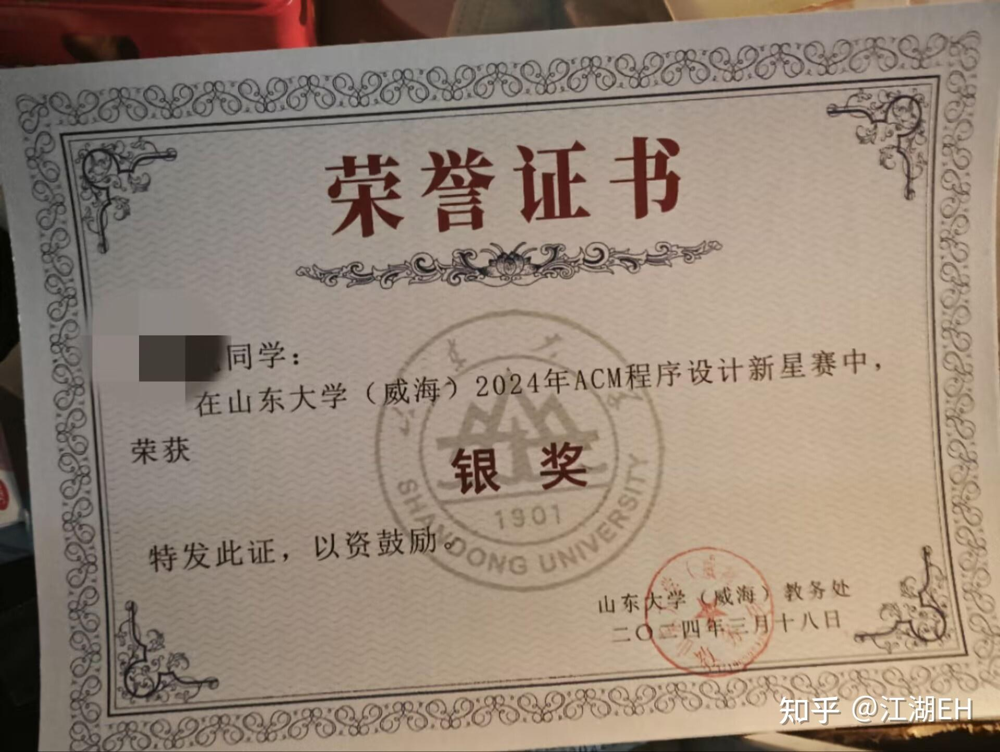

说来惭愧，我们的加训状态一度颇有些“三天打鱼，两天晒网”的味道。而在队伍里，我的水平又是最低的。平日训练赛中，我基本只能负责一些数学题、结论题；至于更复杂的算法实现，则常常只能在一旁望题兴叹。更要命的是，那时的我依旧只会 Python，很多时候连语言本身都像是一道额外的门槛。后来，我们参加了省赛选拔赛，毫无悬念地喜提 no 名额。不过老师仍然相信我们的潜力，建议我们以打星的身份参赛，提前感受一下正式比赛的氛围。

于是，便有了 2024 年山东省赛兼邀请赛之行。

那场比赛规模很大，大到光是告诉别人“我要去参加这样的比赛”，就已经是一件颇有面子的事情。真正坐到赛场上时，我们才发现自己仍然稚嫩得很：整场比赛只做出了 3 题，连二分都还不太会，成绩就算放在正式队里也获不了奖。现在回想起来，那多少有些狼狈，却也足够真实，“打印机”成了我们忘不了的一题（那题卡long long，而且刚需二分算法，而且我当时没学过）。

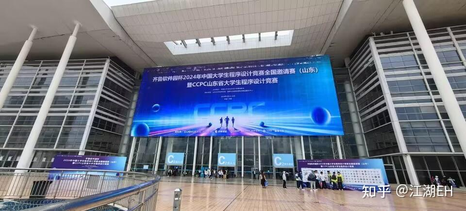

不过，济南还是很好玩的。队友纸船是本地人，赛后便带着我们四处转了转。我们去了趵突泉，也顺路去了SDU趵突泉校区，还在大明湖畔吹了晚风。夜色、湖风、泉水、旧城，还有一群刚从赛场上败下阵来的ACMer——这些画面混在一起，反倒比比赛本身更清晰地留在了记忆里。

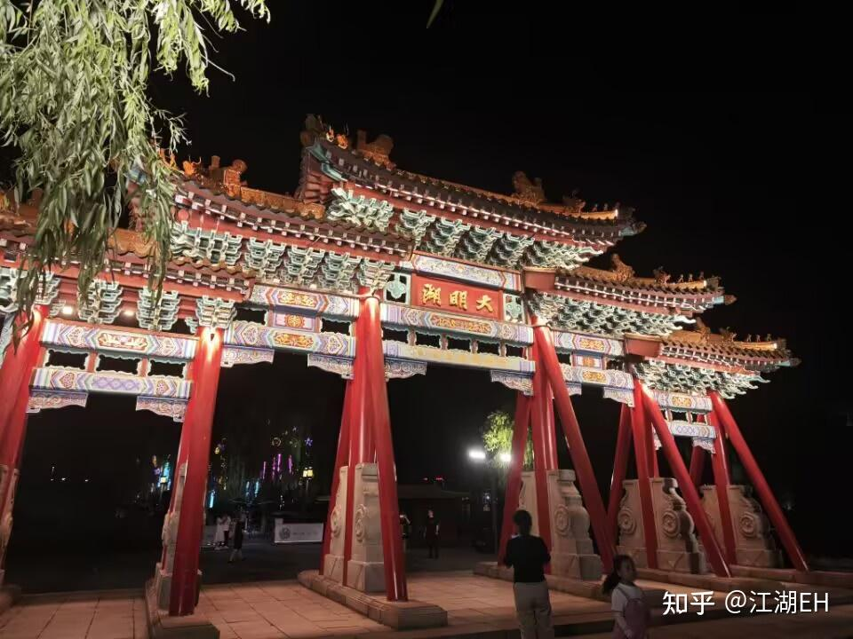

## 大二学期——至暗时刻？

2024 年上半年，其实还有蓝桥杯、天梯赛和百度之星。非常遗憾的是，这些比赛我都没有获奖（蓝桥杯没报）。也正因如此，后来的暑假加训多少也带着些“水水而已”的味道；至于区域赛名额，自然也没有轮到我们。对这样一支队伍来说，未来真的还有拿奖的可能吗？那时的我自己也很怀疑。也许属于我们的 ACM 之路，差不多就要到此为止了。

2024 年下半年的秋季选拔赛带来了一些我心态上的转变。那场比赛里，我作为老队员带榜，和我们学校同级的传奇新人 7_divided_by_3 同台竞技。那时我的加训题量还不到他的四分之一，可最后他也只是比我多做出了一题；甚至在比赛前期，领跑的还是我（不得不说，Python 写起来是真的快）。也正是在那一刻，我感受到：原来在算法竞赛里打出一点名堂，好像也并没有想象中那么难。于是，我开始比较系统地加训，把过去欠下的漏洞一点点补上（B 站up董晓算法讲得不错）。也是在 2024 年底，我开始打 Codeforces，并成功上了青名。

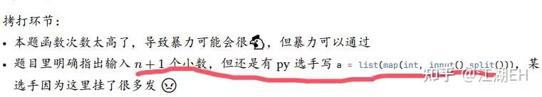

大二下学期，我开始更加频繁地加训。Codeforces 被我打到了 1800 分，我们队也拿到了省赛银牌；我个人则拿到了蓝桥杯国一、百度之星省一。那时我的总刷题数其实也不过 600 左右。算不上多么夸张，却已经足够支撑我走到一个曾经不敢想的位置。我个人认为自己在这方面确实有点小天赋。

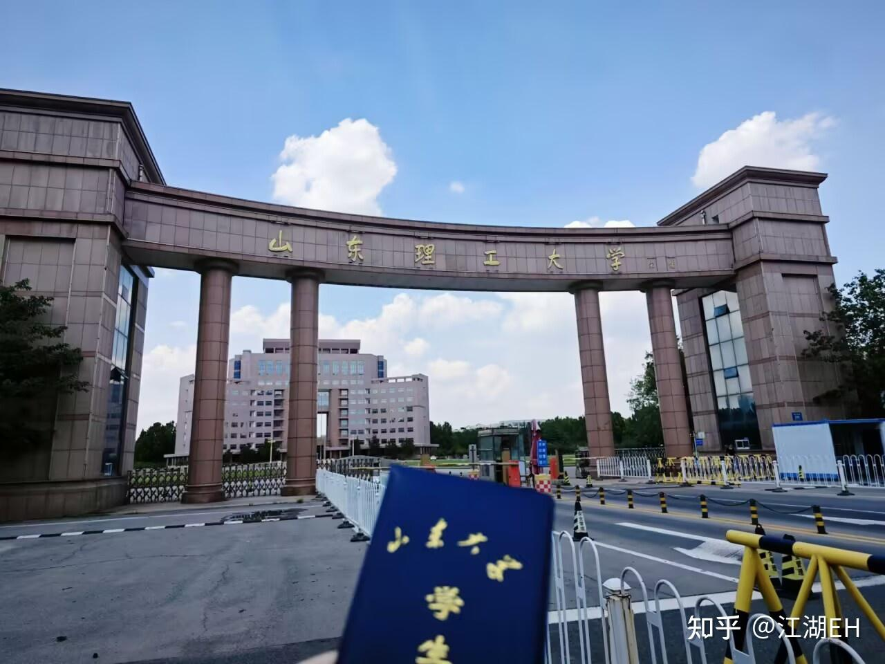

## 大三学期——区域赛

到了 2025 年下半年，我意识到，这大概会是我唯一一次打区域赛的机会了。因为我在积极地备战保研，而假如想让牌子发挥作用，只能依靠这个学期了，大四再拿就迟了。我们暑假的加训其实并不拼命，还是比较水水的状态，可能是还没经历过区域赛的毒打吧。因此，对于一支主要从大二才开始认真加训的队伍来说，想在区域赛拿牌，怎么看都有些不太现实，但我还是想试一试。好在天无绝人之路——我们选到了两个强度最低的 ICPC 站，以及一个强度最低的 CCPC 站。

第一站是西安站。那一场几乎是我一个人在开题、写题，题目分别是签到+二分+LCA+优先队列这么4题，硬是把队伍撑到了铜牌。其实那场我并没有那么高兴，我在反思，假如只靠我一个人发力，最好也只能是这样的成果了，那后续的赛站岂不是难度更大？银牌多半是没什么指望了。

第二站是哈尔滨站，这场是CCPC，难度偏高，我们的预期目标是拿到铜牌就行。让我意外的是，队友开始发力，把一道至关重要的“猜猜题”给过掉了，我们最后极限拿铜。这场我们的配合非常不错，我主要负责偏模板的题目，而队友主要负责强思维的题目。

第三站是沈阳站，它居然提供 PyPy3，于是我们直接手速起飞。这场我和队友配合紧密，我负责写板子逻辑，他负责写主算法逻辑，一点代码错误都没犯。最后，队友还极限发力过掉了那道卡了半个场的结论题，我们破天荒地拿到了银牌。

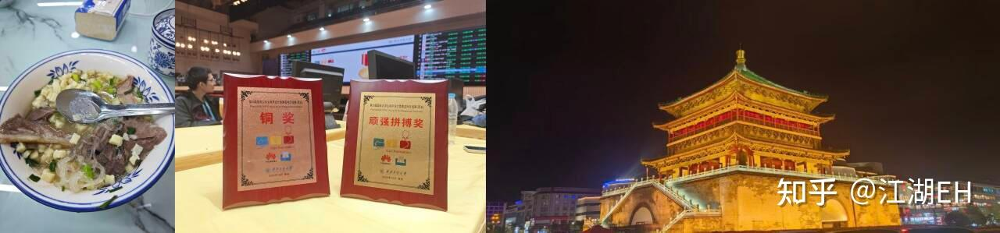

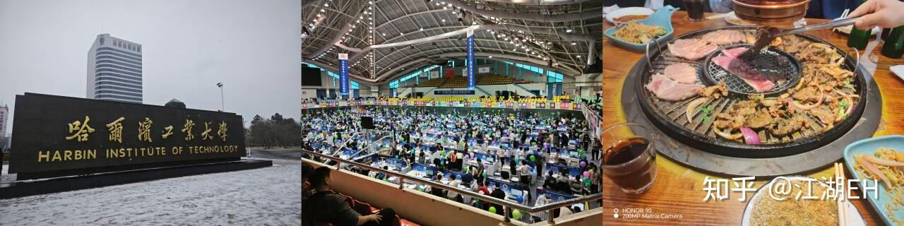

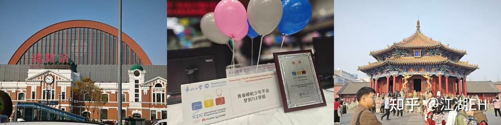

沈阳站拿银的那一刻，可能是我整个 ACM 生涯里最开心的时候。回到学校后，我一边等 cpcfinder 更新，一边等洛谷的官方气球认证，还顺手兑现了之前在 73 群里立下的 flag。现在想想，那种快乐甚至有点幼稚，但也正因为幼稚才显得格外纯粹。

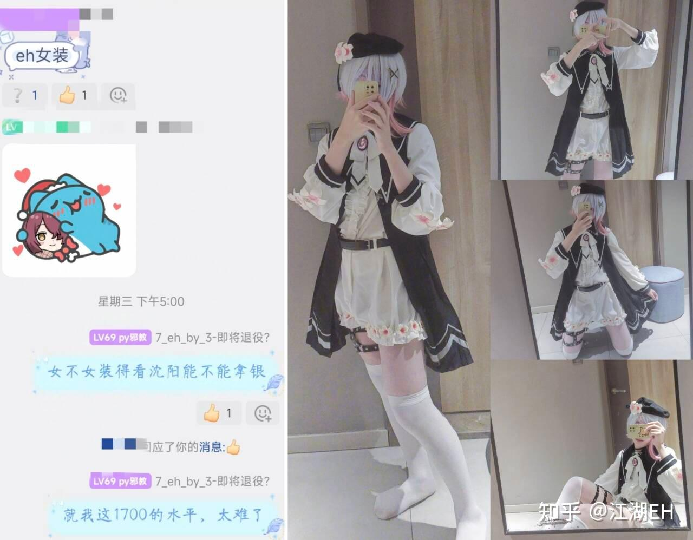

然后就是百度之星了。此时我已无任何牵挂，反正拿银了，这个 astar 也不重要了，我就是去北京玩的！我在北京逛了好一大圈，还顺路去沙河校区打了 cacc。不过从这时候开始，我的水平就已经在走下坡路了——百度之星只过了签到拿到铜牌，今年的 cacc 决赛我没有获奖，省赛也只是拿到了银牌，太可惜了。

省赛银牌确实是我个人的严重发挥失误，我对不起队友们，这是我们蟒蛇队ACM的最后一程，却没有走好。

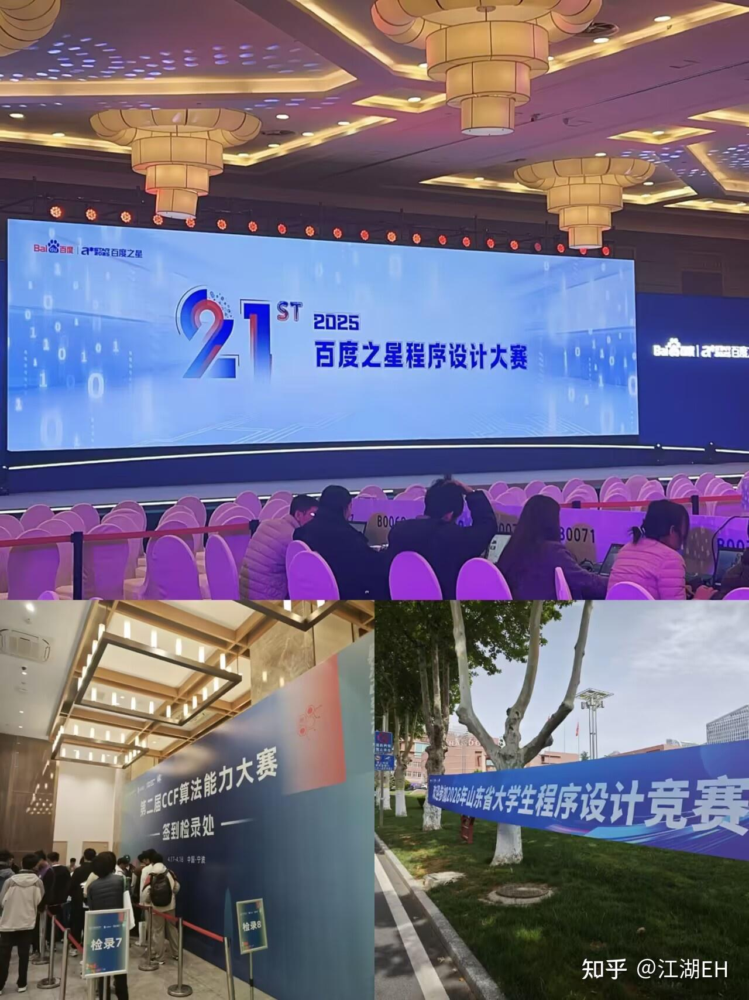

但仔细想想，也没有什么不能接受的。

我并不是一个多么合格的 ACMer。毕竟我没有 OI 经历，全身心投入的时间也不算多，更没有那种“一上赛场就必须拿牌”的决心。我常常摇摆，常常偷懒，也常常在训练、学业与科研之间反复权衡。

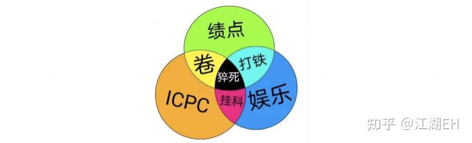

可我终究还是来过一趟。

我体验过和队友并肩作战时的全神贯注，体验过封榜后过题、最终拿到牌子的狂喜，也体验过凌晨归校的火车、赛后城市的晚风，以及无数次调不出 bug 时的怀疑人生。

这些就已经足够了。

ACM 没有定义我的大学生活，却实实在在地丰富了它。它让我认识了朋友，见过了更大的赛场，也在某些瞬间，让我相信自己并没有那么平庸。

## 大四学期——新的起点

随着队友陆续离开，我的心似乎也一点点退役了，因为 ACM 对我再无更多意义，我已经圆满了。不过，6 月的时候，因为隔壁队伍临时缺人，7_divided_by_3 把我拉去打了 CCPC 福州邀请赛。没想到，我们一路打下来，最后竟然拿到了金牌。

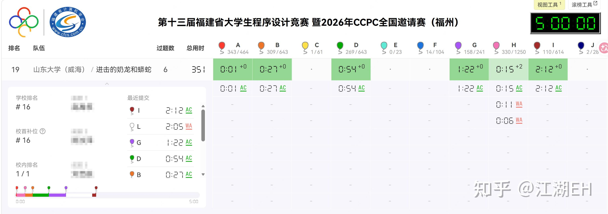

那一刻，原本已经沉下去的心，好像又重新燃起了一点什么。

但后来想想，那其实也不太像“希望”。我很清楚，属于自己的竞赛生涯已经快走到尽头了，9 月就是网络赛，我也未必还在期待着靠最后几场比赛去证明什么。相比之下，那种感觉更像是“化作春泥更护花”。

我只是觉得，在真正离开之前，总还应该为校队做些什么。

而 73 队愿意接纳我，对我来说，也就不仅仅意味着又有了一支队伍、又有了一次比赛的机会。它更像是给了我一个最后继续留在赛场上的理由，也给了我一个能够把自己这些年积累下来的东西，再为校队贡献一点的平台。

然后，时间就来到了九月份的网络赛。那时候的我正忙着保研——其实说“忙”也不太准确。早在八月份，我就已经拿到了保底的 offer，按理说，这反而给了我相当充足的时间去准备网络赛。但我并没有怎么训练。保研顺利之后，整个人一下子松了下来，天天水群、刷视频，沉浸在一种“终于可以歇一歇了”的消遣里。校队上下倒是气势很足，第一场网络赛前还在群里叫嚣着要拿 1.5 倍名额，仿佛区域赛门票已经唾手可得。

结果现实很快就给了我们一记耳光。第一场 IC 网络赛，我们的发挥甚至还不如去年的自己。比赛结束后，整个校队加起来只拿到了两个区域赛名额。此前那些豪言壮语一下子全没了，群里的气氛肉眼可见地沉了下去，一时间颇有种“今年是不是要完蛋了”的感觉。好在第二场，我们顶住了压力，最终队排四百名出头，成功拿到了单倍名额……成绩当然谈不上多么亮眼，但它至少把校队从悬崖边上拽了回来。

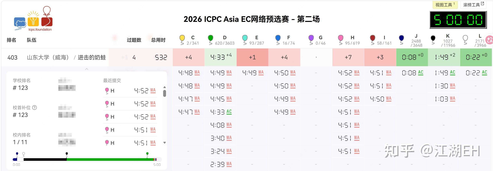

下一场是 CC 网络赛。不过彼时我和一个队友还在本部进行预推免面试，在网络赛前我极限赶了回来，但这次只有两个人打，有个队友没赶回来。前期 73 迅速地秒了 5 个签到题，随后我开出了拓扑排序 + dp，以及范德蒙德卷积 + 计数题，最后一题是计算几何，正好碰到我的长处，于是也迅速通过了，本场打出了最好战绩第 231 名，并拿到了一个额外名额。

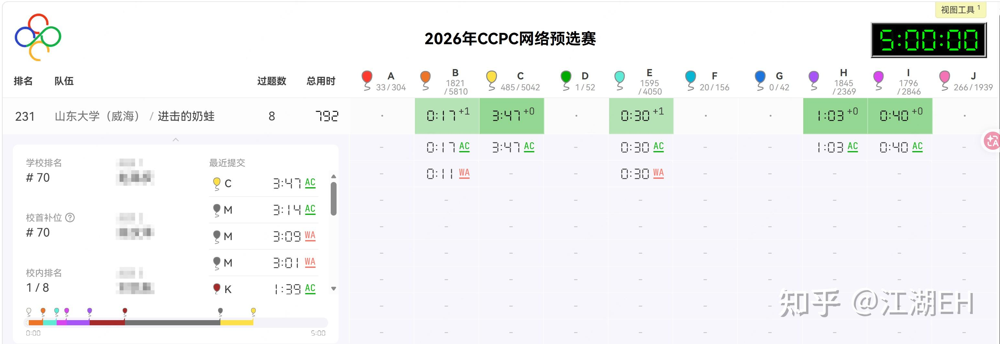

接下来是区域赛，不过具体去哪一场“旅游”，还得看导师以及队友的时间安排嘛。

