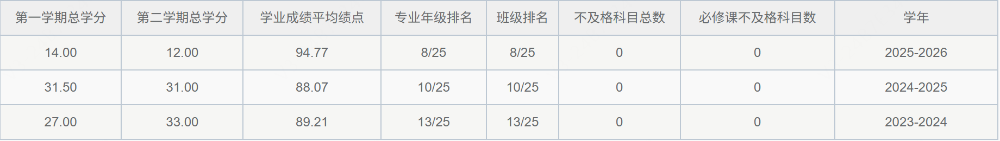
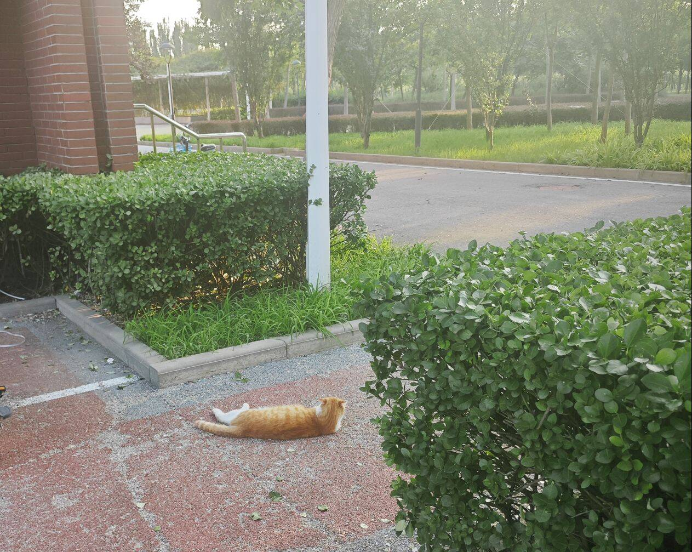

## 绩点与综测波折

我大一到大三的绩点排名逐年提升，每提升一步我将更接近保研。但是我主要的优势其实还是素养。我们学校基础60分的素养里我拿了48分，在我们班保研的那伙人里，这个分数是最高的。

我直到大三下前，都在为保研名额发愁，我们班往年的保研率是30%以上，正常来说是25个保8个的。但是去年是22个保7个，这让排名第8的我非常害怕，一方面是我后面的人可能突然拿个国奖把我斩杀，另一方面是假如今年跟随去年的脚步，不履行30%的约定，而是直接跟随着保7个呢？

这让我一度产生了出国的想法。我在26年2月份跟家里人讨论说要不要润港校，但是他们认为还有保研的希望就得抓住，可能是家里经济情况并不乐观不便明说吧，假如真的保研失败了，我再一两个月突击托福也还是来得及的，所以接下来我还是坚持保研大业了，幸运的是最终排名第8，并且前排有一个选择出国了的，实际保研名额发到了第9。

然后我开始正式地准备保研工作。

我的bg（背景）是
学业：中下9，绩点分数89.7，rk10/25，百分比为40％

科研：有两段科研实习经历（怀柔实验室/南大智科吉炜老师组），发了三篇论文，一篇国内期刊，两篇CCF-A会二作（都排名第二+二作），一篇CCF-A会一作在研

竞赛：CCPC邀请赛金牌，ICPC区域赛银牌，蓝桥杯国一，节能减排国三

## 夏0营

5月份开始报夏令营，按照往年学长的经验，我至少能去计算所，华五也有不小的机会上。我彼时的导师一个是ailab的，一个是南大智科的。我非常又自信啊，先后报名了上海ailab、计算所春闱计划、中科大科学岛、北大深圳院、人大信院、中科院工业人工智能研究所、天大人工智能等一系列学校，全部被拒！这时候我感觉，应该是夏令营门槛太高了导致的吧，那我等待预推免得了呗。

## 预推免

结果预推免也没有好到哪里去，我报名了哈工大、西交、东南、同济等学校，就只有西交软院让我入了，可是我又不想去西交软啊。早在报名东南之前，我7月份可谓是一个地方都没去，8月份回到家后，家里也有压力，非常难受，其实家里也没有多少压力我，就是我一直都拿不到下一个offer导致的父母跟着一起焦虑罢了。

我在8月份正式决定我不考虑任何直博。因为现在再联系直博多半只能找到普导了。我选择学硕。我的绩点排名非常不好看，所以我决定放弃华五，因为华五硕士多半会卡一下排名嘛。我把眼光下放到东南之类的学校。在8月5号的时候，我套磁了一下一个palm实验室的老师，希望它可以把我捞进去。面试很简单我回答得非常顺利，那边的博士生学长本科是来自山大的，问我这么好的背景为啥来东南而不是华五，我很感谢他的安慰，但我确实也只能来这儿了，因为华五必然被卡。我还投了一个南开大学cmm组的老师。本来是投好几个的，结果东南那边投了好些都回复+加微信了，感觉同时联系好几个老师怪不好意思的，于是南开这边我只联系了一个。

这个老师很快回复了，经过40分钟的面试，我通过了线上考核，并答应去他们的线下考核，这是我的第一个offer。线下的考核第一天是体能活动，由老师带路，我们绕着校园跑了整整一公里。然后第二天是机试，我40多分钟直接ak了，线下面试我没有多在意，其实也是顺利通过了已经，因为我是打算把这个当作保底的。

结果后来传出来消息说，今年palm的老师没有捞人的能力，我确实也没有入营东南，不过好在我已经拿到了cmm组的学硕offer，我非常高兴呐，至少比这个差一级的学校和组都不需要考虑了。而且天津也是一个好地方，离北京近，实习机会非常多。

ailab的老师最后说他找不到我的简历所以捞不了我，说我是被卡机筛了。南大的老师更是直说他的名额用完了，让我自己报名硕士去......我顿时感觉被这两个老师抛弃了，就连跟他们目前正在合作的论文我也没有多少继续做的动力了。但是我总得去更好的地方吧！我尝试投了一下哈工大深圳，还有北航。哈深没入，结果北航我依靠银牌入营了，但是我没有在北航联系任何一个老师啊！而且，北航和山大人工智能的时间冲突了，由于先前的屡屡受挫，我不敢再尝试北航了，即使我拿到了优营，我估计也不会去的（好的老师早就没了）。然后我顺利拿到了sdu ai的优营，甚至是总分第二。假如我提前联系了北航的好导，结果会不会好一些？

可是没有假如！目前的结果已经非常满意了！接下来的故事将在南开——天津展开了，让我们拭目以待。

猫猫，没想到我还会再来吧!