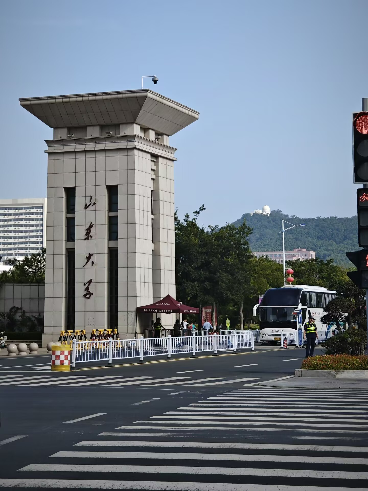
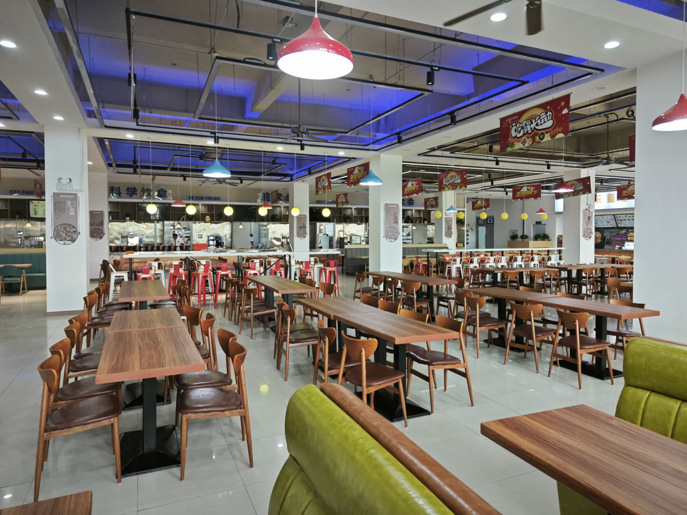

## 大一上 · 九月

初到山东大学，映入眼帘的便是一座气势恢宏的校门。虽然这里是威海校区，但实话实说，它带给我的震撼丝毫不逊于本部。校园给人的第一印象很不错，而食堂也同样让人惊喜——饭菜确实很好吃。

我们宿舍的氛围也特别好，闲的那会儿还和两个舍友一起开黑吃鸡，忙的那会儿整个宿舍齐心协力备战期末考。一个好的宿舍氛围真的很重要，它带来良好的生活习惯。

很快我迎来了数科班考试和泰山学堂考试，事实证明进入这个数科班是一个错误的选择，小班制带来的保研排名百分比劣势极其严重，但当时的我引以为荣，本身我对计算机就挺感兴趣的，数学+计算机真是一个巨大的诱惑。

我确实顺利进入了数科班，也通过了泰山学堂的笔试（数学方向），不过面试没过（这太难了）。由于是高考落榜来的山威，我并不认为自己有多差，反而有一种鹤立鸡群的优越感：“你看，我不需要多少努力就考进了数科班！”这也为后来的失败埋下了伏笔。

刚进入大学的我广交友，乐观开朗，短时间之内不少人就知道我是个“很有能力的人”，我因此感到沾沾自喜。

一起来

