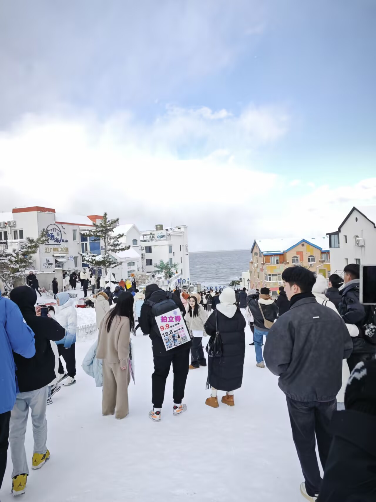
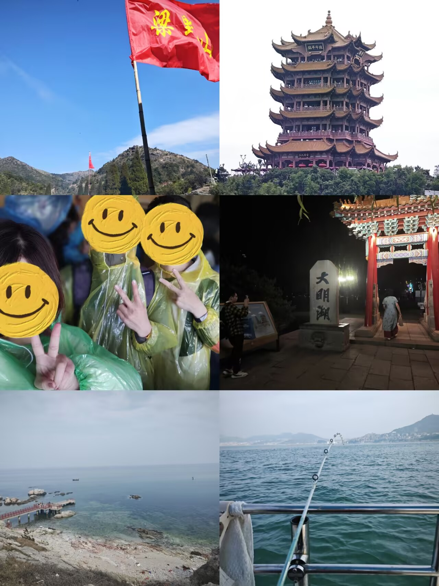

## 大一上

我在大一上没有做出什么轰轰烈烈的事情，整体上还是在探索学校，非常单纯啊！带些许稚嫩的心理，可惜以后再也没有这么纯粹过了......

### 9-10月

初到山东大学，映入眼帘的便是一座气势恢宏的校门。虽然这里是威海校区，但实话实说，它带给我的震撼丝毫不逊于本部。校园给人的第一印象很不错，而食堂也同样让人惊喜——饭菜确实很好吃。

我们**宿舍**的氛围也特别好，闲的那会儿还和两个舍友一起开黑吃鸡，忙的那会儿整个宿舍齐心协力备战期末考。一个好的宿舍氛围真的很重要，它带来良好的生活习惯。

很快我迎来了**数科班**考试和泰山学堂考试，事实证明进入这个数科班是一个错误的选择，小班制带来的保研排名百分比劣势极其严重，但当时的我引以为荣，本身我对计算机就挺感兴趣的，数学+计算机真是一个巨大的诱惑。

我确实顺利进入了数科班，也通过了泰山学堂的笔试（数学方向），不过面试没过（这太难了）。由于是高考落榜来的山威，我并不认为自己有多差，反而有一种鹤立鸡群的优越感：“你看，我不需要多少努力就考进了数科班！”这也为后来的失败埋下了伏笔。

刚进入大学的我**广交友**，乐观开朗，短时间之内不少人就知道我是个“很有能力的人”，我因此感到沾沾自喜。平时上课也是积极地坐在第一排，好好听老师讲课，按时完成课后作业。也因此开学那会儿很多人会积极地来请教我数学问题。在数科班也如此，我早早地在暑假和军训期间学习python语法，在数科班前几次课我就展现了出色的编程能力，进一步提升了自己的知名度。

### 11-12月

逐渐认识到，这个数学分析有点枯燥无趣啊，这么理论的东西真的可以做出成果来吗？我是不是不适合学数学，应该是高中时期的自己对数学的滤镜太重了，实际上数学并非如此有趣。或许我应该高考报考计算机专业的......但是那得631分，我也还差个1分呐。

我加了学校的数据科学协会群、飞桨领航团，我还去找了22数科的学长并加入了他的科研立项，从此我的目标改为人工智能方向。只不过那个时候的AI并不发达，大家挤破头了在研究CNN等现在看起来非常基础的东西。最好的模型为GPT3，并不好用，文心一言就更不用说了，用来写实验报告还差不多。

威海的雪真的非常震撼，它不回一直下，但是会集中性地下，下的那几天真的很疯狂啊！每天跨越风雪去上课，都显得很有生活气息。

### 来年的1-2月

期末考总体上还是顺利的，不过我并不清楚我以后的发展规划。站在大四的角度评判大一的自己还是太过火了。当时并不明白绩点于保研的重要性，以为只要有名额就完事了，所以我卷课内也不是那么用功。我歧视那些必修的文科比如近代史纲要——因此毫无准备，期末我只拿了53分。我的绩点排名为8/25，当时感觉保研要没希望了。

寒假期间我在学习深度学习相关知识，不过那时候的代码能力并不行。所以当我学到CNN那边的时候，我就已经有点看不懂了。结合AI的能力，我才算是写出来一个看起来还行的项目——动物分类模型。我因此非常高兴，甚至把它转发给各个同学和学长来评价。

## 大一下

每个第二学期都是人生最黑暗的时候。中学如此，大学也如此。我并不明白这是怎么一回事，事实如此。

### 3-6月

我参加了校程序设计大赛新星赛——这是一个历史性的时刻，他严重影响了EH的人生轨迹。我再什么都没有学的情况下，顺利地通过了5题，极限地加入了校队，并和两个数院的队友组队。从此我们参与ACM集训，打天梯赛、打省赛，虽然菜菜的，但是还挺滋润。

如上图，我在这学期期间的旅游计划是相当丰富的。从左到右，从上到下，我先后去了武平梁野山顶、武汉黄鹤楼、蓬莱欧乐堡、济南大明湖、烟台养马岛、威海海钓。真是一个充实的大学生活呐。

这段时间的学习也不能落下，我加入ACM集训队后，在不断地学习C++语法，因为这是解题的必备语言！并同步学习数模的一些知识......不过至于课内我就没有管那么多了，毕竟大一上已经感觉保研要没希望了......然后我大一下的绩点全面崩盘了，平均只有86分多。拉上综合成绩一算，好家伙，居然还有8/25，又燃起了保研的希望。

### 7-8月

我的大作业完成得非常出色，拿到了最高分。除此之外，我发现了董晓算法这个宝藏up，我几乎的算法都是在他那里学的。

然后，没了。大一的生活如此，纯粹，干净。