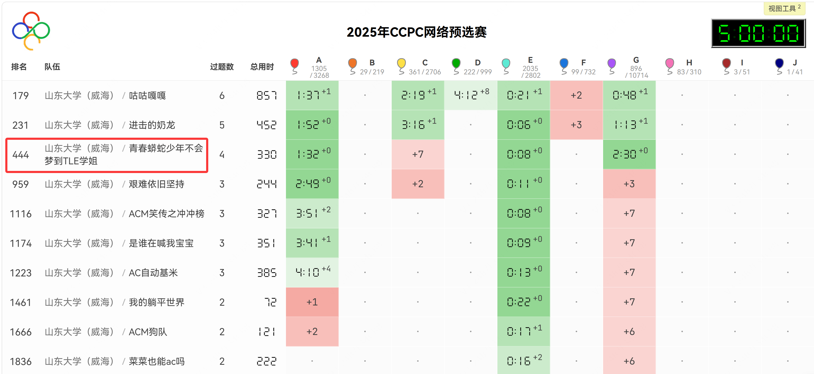
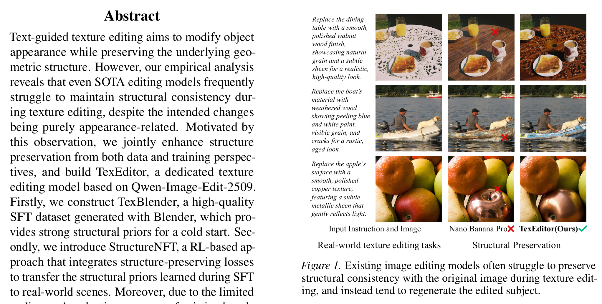

## 大三上

### 9月

这个月的主目标是数模，副目标是网络赛，因为网络赛打不好的话，我们连区域赛的资格都没有！结果是数模做得差强人意，我觉得再差也至少有个省一的那种。由于数模的影响，我们第一场网络赛并没有打好（睡太少了）。不过第二场和第三场我们的发挥都相当亮眼，最终斩获两个IC名额，一个CC名额。

具体的 ACM 系列可以移步至 [ACM 生涯](/zh/blog/acm生涯)

与此同时，22学长推荐我去怀柔实验室的科研实习，我9月底主要的工作就是在那里干了一篇论文出来，负责的东西是制定电网问题的评估框架，以及强化学习。这是我第一次做科研，我也是第一次感受到，其他学校/研究所的算力资源居然如此丰富。

不过第一次做科研还是吃了不少苦的，我环境配置不熟练，也不知道怎样多卡训练，也不会开并行/后台运行，文件管理也十分混乱。不过这些问题随着我对科研的深入逐步解决了，它是一个长期的工程素养。

### 10月

数模出结果了，我只拿到了省二。9月份的那个期刊也投出去了，那个论文没啥含金量，但是也算够用吧，这时候那边的学长让我跟他一起干一篇CCF-A论文出来，本来是赶CVPR的，但是彼时我还得打ICPC区域赛啊。赶论文的机会又很多，但是区域赛只有3场能打了。不过这段时间距离期末还有很长的一段距离，需要考的科目还是我擅长的运筹学。

我索性all in区域赛+科研，科研做完了就加训。这段时间的科研任务也不算重，主要就是利用blender做一些物体在不同材质下的渲染，然后拍照，去生产这样的图像对而已。

非常顺利的，我西安区域赛拿到了铜牌。穿插一个小趣事，由于主办方的失误，他们把我们的重复提交当成有效提交了，我们还混到了“顽强拼搏奖”。在西安我没有跟随队友去玩，我选择待在酒店去完成科研任务。

### 11月

第二站是哈尔滨站，这场是CCPC，难度偏高，我们的预期目标是拿到铜牌就行。让我意外的是，队友开始发力，把一道至关重要的“猜猜题”给过掉了，我们最后极限拿铜。

第三站是沈阳站，它居然提供 PyPy3，于是我们直接手速起飞。这场我和队友配合紧密，我负责写板子逻辑，他负责写主算法逻辑，一点错误都没犯。最后，队友还极限发力过掉了那道卡了半个场的结论题，我们破天荒地拿到了银牌。

这部分内容复制自 [ACM 生涯](/zh/blog/acm生涯)。

我的任务线依旧是科研+竞赛，不管课内。

### 12月

在73群水群的时候，2.333他打算赶ICML会议论文，因为他要给来年留出足够的时间考研，想赶紧把论文投出去了。但是他目前的实验还没有明显的成果，主题框架是搭建好了，需要找个人去帮忙跑跑实验。我评估了一下自己的时间安排，最终决定帮助他。因为此时我已经拿到了银牌，没有任何牵挂。

学长那边给了我快手的卡使用，我就用那边的卡跑这边的实验。两边都干科研说实话有点小忙，还好我们的期末考算简单的，我草草复习了一周也拿到了不错的成果。

### 1月

**期末考+科研**要把我折磨疯了。这科研很坐牢啊，每天9点起来去文学楼自习+讨论，跑实验/画图/写论文，持续了整整半个月！好在结果是好的，大概在1月底的时候提前干完了。

## 大三下

每个上学期会超神，那么下学期就会超鬼。

我去打了CACC决赛，没获奖。去打了山东省赛，依旧银牌。去打了CCPC福州邀请赛，虽然金牌但毕竟是CCPC，没啥用。

我尝试去做我自己的一作论文，计划发AAAI，但是和今年一篇6月份刚发的文章的idea完全撞了，被迫加内容，到现在也没有新的进展。我在今年5月份才得知我之前3篇论文都中了的消息，但那毕竟是上学期的工作了。

整个大三下学期像是在虚度光阴，但我在想，更多的内容应该是保研之路了，这里就不多赘述了，详见 [EH 的保研之路](/zh/blog/eh的保研之路)。