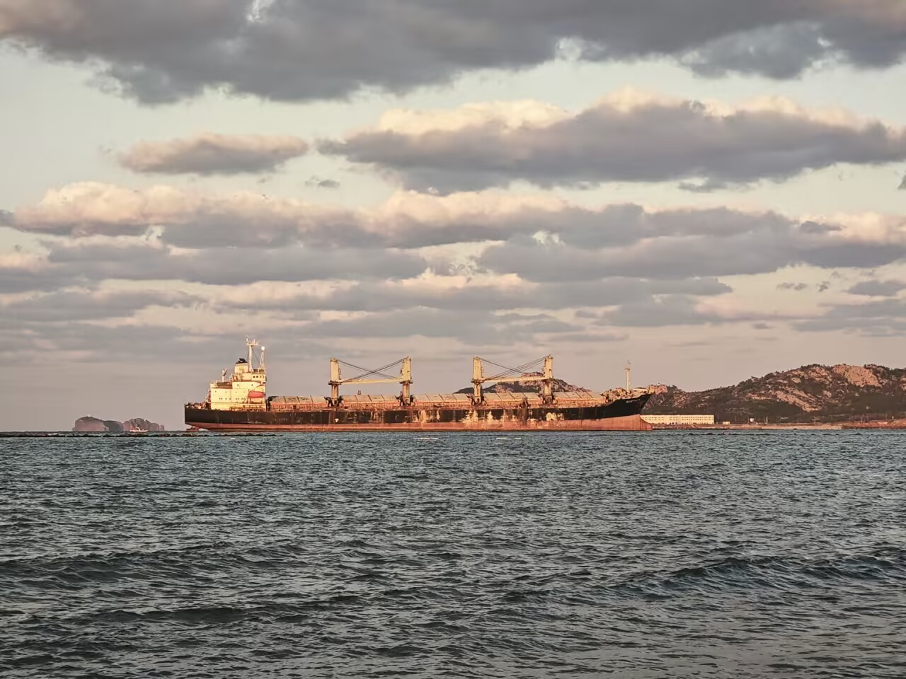
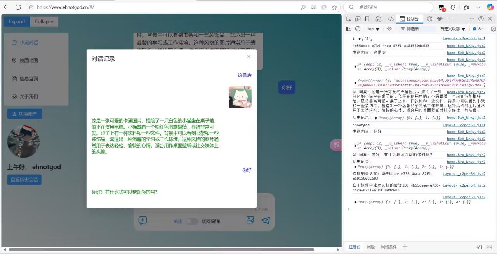
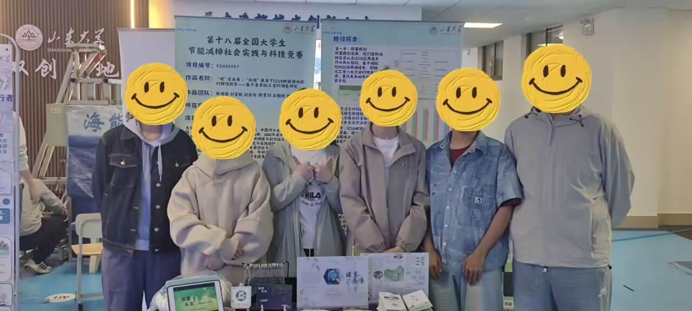
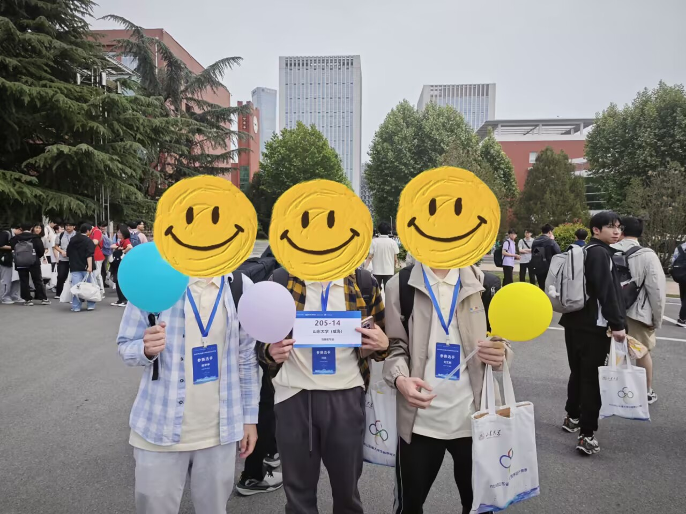
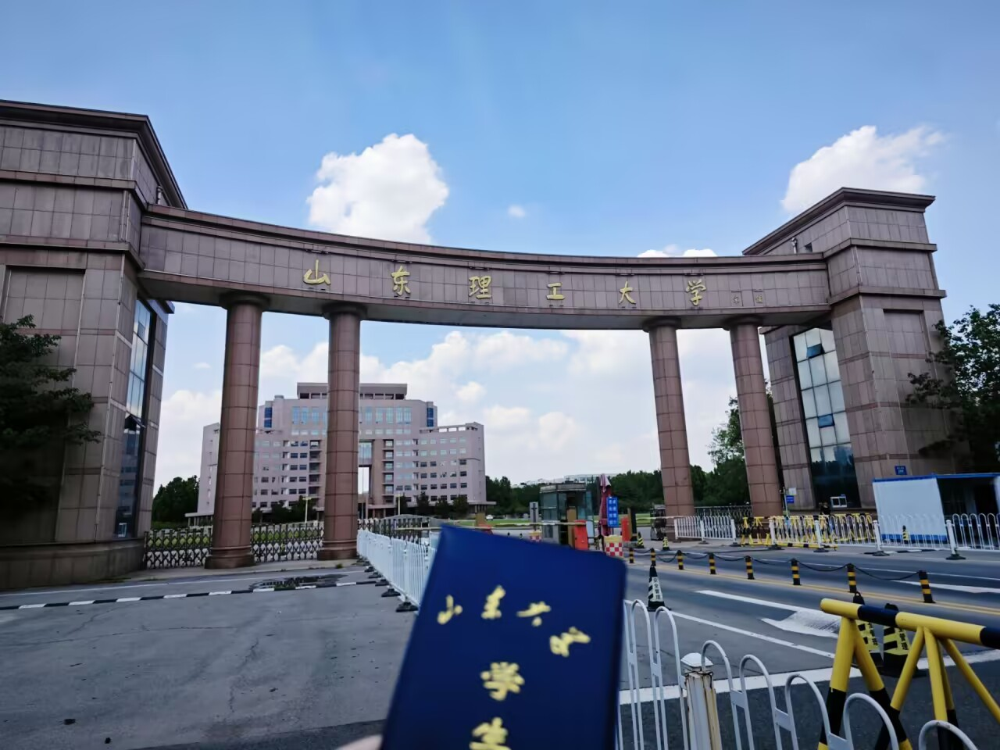
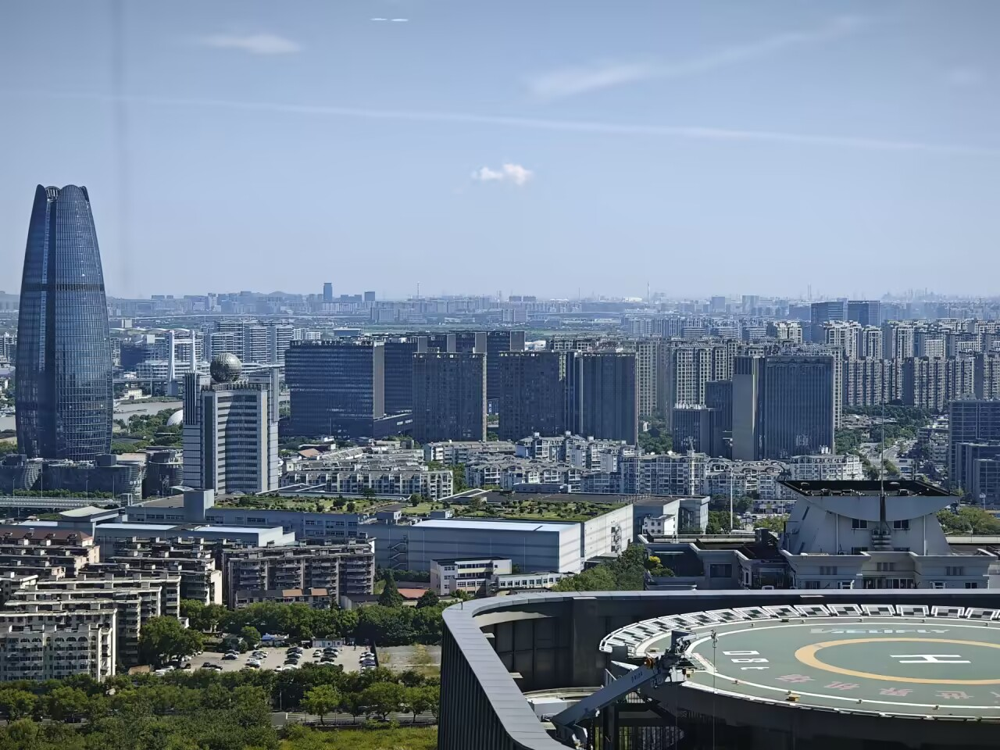

## 大二上

### 9-来年1月

接回大一上。到了这个时候，我终于逐渐意识到一件事——我好像真的可以保研。

于是我立马开始卷绩点。

这个学期的主线其实非常单纯：**学习、卷分、大作业**。除此之外倒也没什么特别忙的事情，整个学期过得异常平平淡淡。我每天就在数学分析、概率论、集群网络、数据库这些课里来回折腾，中间还夹着毛泽东思想和中国特色社会主义理论体系概论、习近平新时代中国特色社会主义思想概论这两门偏文科的课。

也是在这个学期，我当上了学委。不得不说，学委的“权力”可谓非常之大呐。尤其碰上这种偏文科、平时分占比又不低的课程，作为天天和老师、作业、通知打交道的学委，我的平时分自然也是混得相当滋润。

至于期末，我依旧延续了自己的传统艺能——考前速通，但这次，我不再是一周速通，而是一个月速通！考完后本来我也没觉得自己能考多高，结果成绩出来以后发现多少有点逆天：数学分析 97 分，专业第二；概率论 91 分，专业第五。最离谱的是，我明明感觉自己学得也就那么回事，最后一看成绩单：怎么又这么高？

然后这学期我的绩点大抵拿到了班级第二左右，这是我保研路上的一个重大的翻盘点。

这学期我们还去布鲁维斯号那边玩了，大概在国庆的时候——自此之后我的旅游行动就停滞了。当时我的好多高中同学也来威海旅游了，我们是自驾游去的布鲁维斯号！那个船真的很壮观很出片！然后第二天曹公带我们逛了哈威，我们带他们逛了山威。

这学期还有一个主线任务是大作业，是全栈开发，做一个校园知识对话网站。我使用Vue3+pinia+Element plus搭建前端，用fastapi+mysql搭建后端，不过由于网站没有做完美，最终没有拿到高分。

## 大二下

### 2-8月

我的比赛之魂，也差不多就是从这个时候彻底觉醒的。

这其实源自我大二上学期的一个判断：既然我期末靠突击一个月就能拿到不错的成绩，那平时那些相对空闲的时间，好像完全可以拿去做点别的事情。毕竟那时候保研还没有稳到让我彻底放心，而之前一起打美赛的队友又来问我要不要参加她的大挑和节能减排，于是我几乎没怎么犹豫就去了。

当时我的目标其实很朴素：拿个国家三等奖，给保研再加一点额外的筹码。

打创赛的那段时间是真的忙，也是真的累。做材料、改方案、准备答辩，来来回回折腾了很久。我在团队里主要负责建模，这件事本身不算特别难，但又是项目里很重要的一环。比起最后拿到什么奖，我后来反而更庆幸自己在这段经历里第一次真正明白了：一个项目究竟要怎么讲，计划书究竟要怎么写，又应该怎样站在评审者的视角去判断一个项目到底好不好。

当然，如果单纯从结果来看，这其实是一个非常“不值当”的计划。它占用了我大量时间，最后换来的不过是一个含金量并不算高的节能减排国三。后来再回头算投入产出比，这笔账怎么看都不漂亮。

但如果人生里的所有事情都要拿“性价比”来衡量，那我后来大概也不会去打那么多比赛了。有些事情值不值，并不完全取决于它最后换来了什么。想做就去做，活得潇洒一点，这也很重要。

然后就是程序设计大赛，在这一点上我发现我们并不菜，逐渐成长为了校里数一数二的队伍。

我们依旧去打了山东省程序设计大赛。这场我信心满满，但最后还是差点翻车了，还好队友稳住心态，极限开了一题。最终我们封榜后通过两题，获得银牌。

紧接着我们还去打了蓝桥杯，淄博烧烤真的非常好吃实惠呐！这场蓝桥杯我的发挥堪称完美，顺利拿到了国家一等奖。

不过在我意料之外的，由于我过度相信期末突击，实际上我考得非常差！我只拿到86的平均绩点！这非常差，把我大二上学期的优势全部搞没了！

暑假期间我主要的工作还是ACM加训，因为我现在什么也没有了，我都盘算好保研不上，那我就在大三上拿牌，然后寒假考雅思，直接润港得了......这是一个非常黑暗的时期，不过我还是忙里偷闲了一下，去宁波培训了一下ACM，顺带旅游，拿几天非常难忘，每天吃好喝好还不需要交钱，也就是在这个暑假，我的算法水平突飞猛进，有了区域赛拿牌的迹象。

